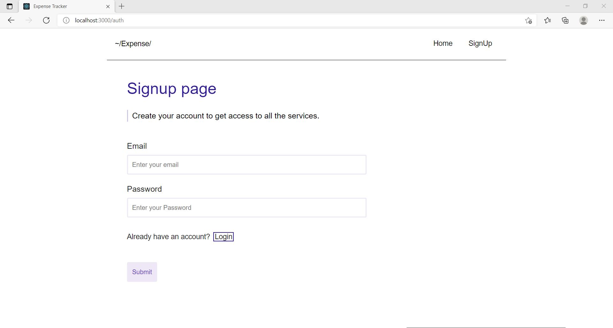
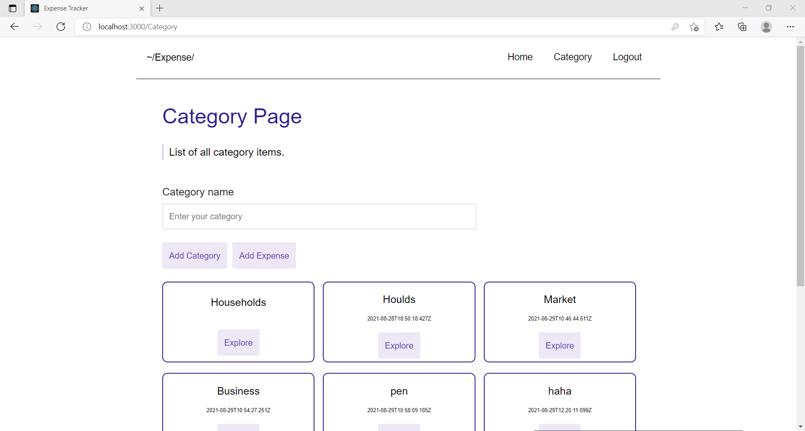
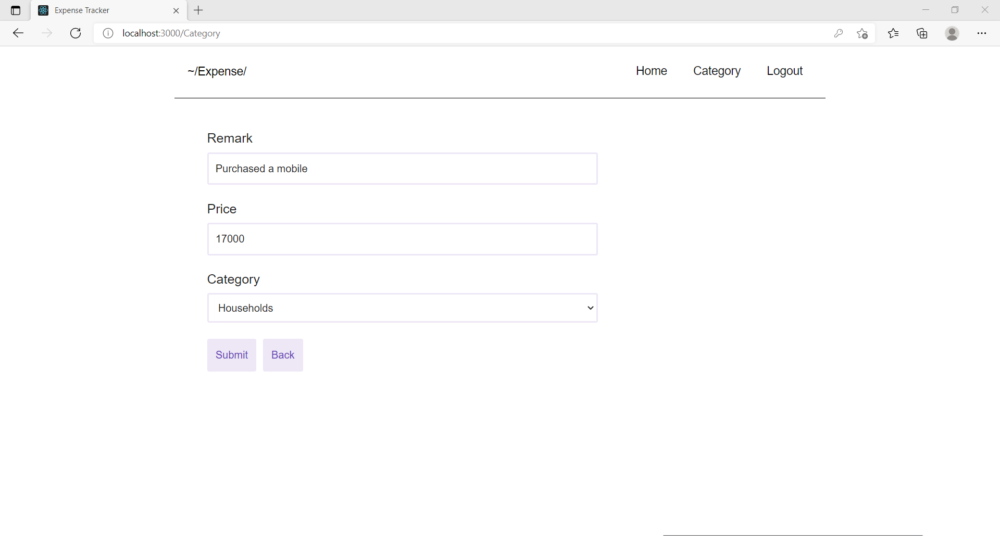
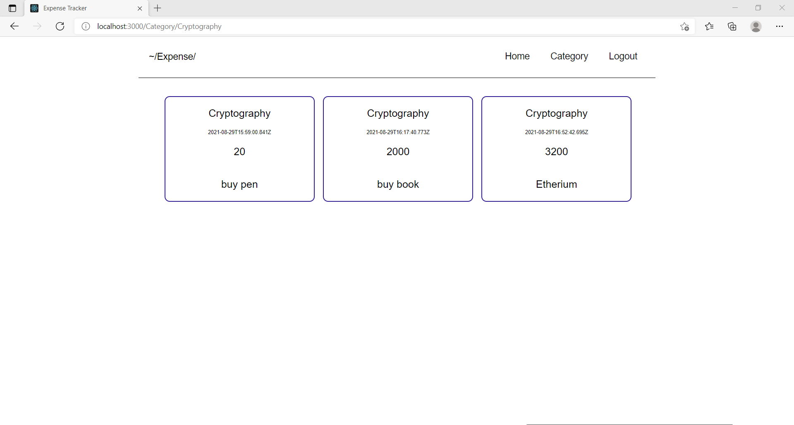
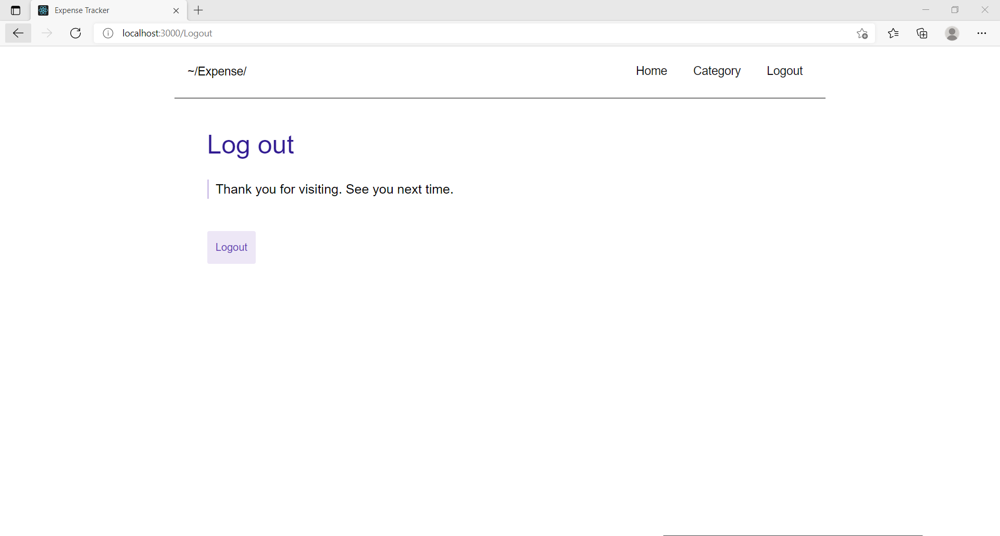

# Expense_Tracker

### [Demo link](https://expense-tracker-task.vercel.app/)

## Demo user

### Email: testing@gmail.com

### Password: s1234

### How to run

```bash
npm i
npm start
```

```bash
cd client
npm i
npm start
```
### Features 
#### 1. Signup and Signin feature for users
#### 2. User can add a new Category
#### 3. User can add a new expense in a categories
#### 4. User can view Categories and Expense Screen

### Demo Images
#### Signin and Signup Screen

#### Caterogy Screen

#### Add Expense Screen

#### Expense List Screen

#### Logout Screen


